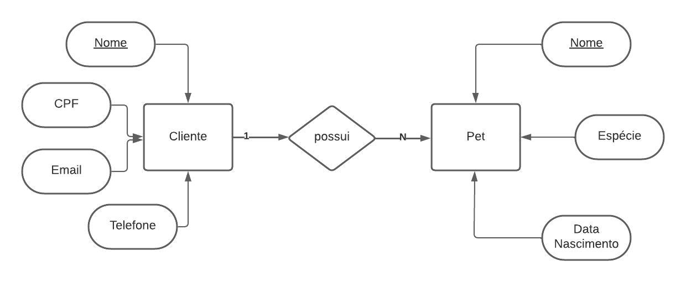

# Exercicios para aula de banco de dados do curso ADS segundo semestre na FACENS.

## Exercicios:
1. Um petshop deseja manter cadastrados seus clientes bem como seus pets. Um cliente deve informar seu nome, CPF, e-mail e telefone, além do nome, espécie e data de nascimento de seu pet.

Script sql:
[SQL PetShop](Scripts/ScriptSQLPetShop.txt)

##
2. Em uma produtora de games, há desenvolvedores, que possuem um nome, CPF, data de nascimento.

Script sql:
[SQL Produtora Games](Scripts/ScriptSQLProdutoraGames.txt)
